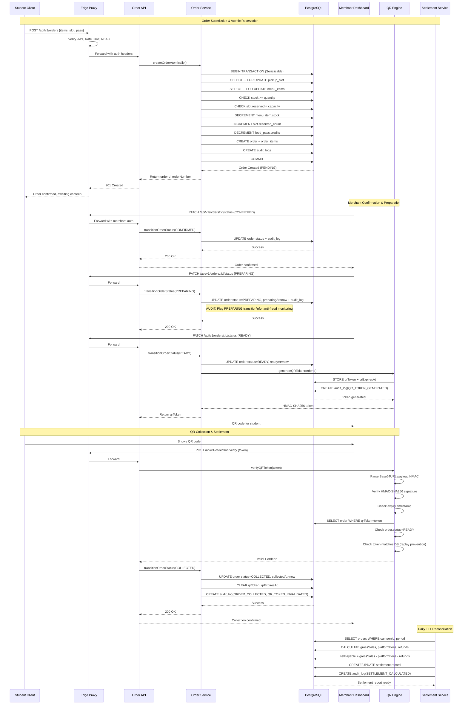
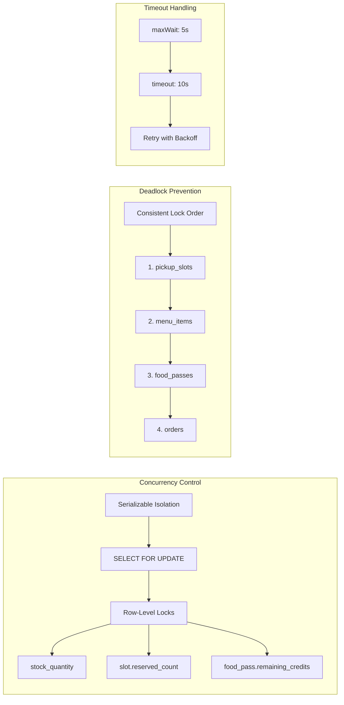
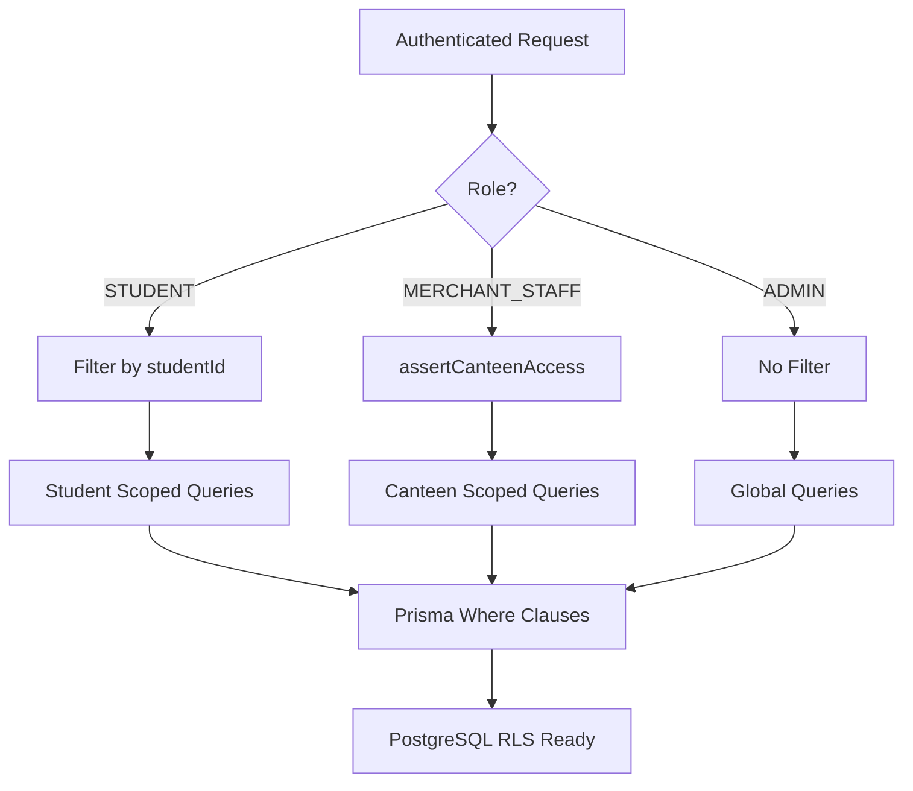
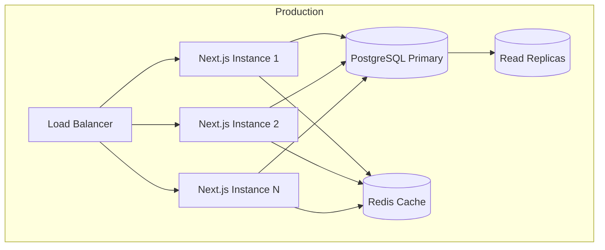

# System Architecture Documentation

## System Topology

```mermaid
graph TB
    Client[Client PWA\nNext.js App Router] --> Edge[Edge Proxy\nsrc/proxy.ts]
    Edge --> Auth[JWT Verification\nRate Limiting\nRBAC Guard]
    Auth --> Router[TRPC/REST Router Layer\nsrc/app/api/v1/*]
    Router --> Service[Service Layer\nimport "server-only"]
    Service --> DB[(PostgreSQL\nPrisma ORM)]

    subgraph "Edge Layer"
        Edge
        Auth
    end

    subgraph "Application Layer"
        Router
        Service
    end

    subgraph "Data Layer"
        DB
    end
```

## End-to-End Atomic Order Flow



## Database Locking Strategy



## Multi-Tenant Data Isolation



## Key Architectural Decisions

### 1. Edge-First Authentication
- JWT verification at edge (`src/proxy.ts`) before request reaches App Router
- Rate limiting per user/IP at edge
- RBAC guards prevent unauthorized route access
- User context injected via headers for downstream use

### 2. Service Layer Isolation
- All services use `import "server-only"` - cannot be imported in client components
- Database access only through service layer
- Business logic encapsulated in services, not in route handlers

### 3. Atomic Order Processing
- Serializable transactions for order creation
- `SELECT ... FOR UPDATE` on critical resources (slots, stock, passes)
- Consistent lock ordering prevents deadlocks
- All mutations create audit logs

### 4. State Machine Enforcement
- `OrderStateMachine` class validates all transitions
- Server-side only - client cannot bypass
- Role-based transition permissions
- Complete audit trail for every transition

### 5. Cryptographic QR Security
- HMAC-SHA256 signed tokens with nonce
- Single-use enforcement via database token matching
- Time-limited validity (30 minutes default)
- Replay attack prevention via token invalidation

### 6. Settlement Mathematics
```
Net Payable = Gross Sales - Platform Fees - Refund Adjustments
```
- Daily T+1 batch calculation
- Platform fees = commissionRate × collected order totals
- Refund adjustments from cancelled/rejected paid orders
- Audit trail for every settlement calculation

### 7. Alternative Suggestions (Consent-Based)
- Algorithm considers: distance, price, time, stock, capacity
- Ranked by match score (100 = perfect)
- **Never auto-redirects** - requires explicit student acceptance
- Audit logs track suggestions, acceptances, declinations

## Deployment Architecture



## Scaling Considerations

| Component | Strategy |
|-----------|----------|
| API Layer | Horizontal scaling (stateless Next.js) |
| Database | Read replicas for queries, primary for writes |
| Connection Pool | 20 connections per instance (configurable) |
| Rate Limiting | Distributed via Redis in production |
| QR Tokens | Short TTL reduces storage pressure |
| Audit Logs | Partitioned by month, archived yearly |
| Settlements | Async batch job, not real-time |